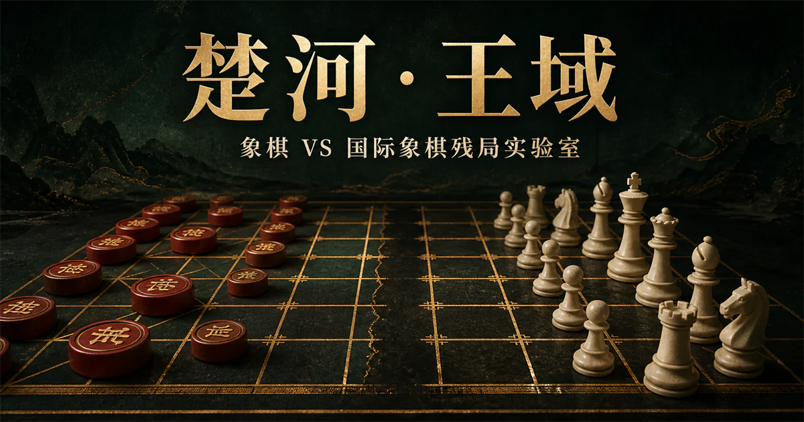

<div align="center">

# 楚河·王域

**在同一张 9×10 棋盘上，破解经过全分支搜索证明的象棋 VS 国际象棋强胜残局。**



[](./LICENSE)
[](https://nodejs.org/)
[](./lib/puzzles.ts)

[在线体验](https://chuhe-wangyu-endgame.lrk-wer.chatgpt.site) · [规则与审计](./research/README.md) · [参与贡献](./CONTRIBUTING.md)

</div>

## 这是什么

楚河·王域是一套可玩的跨棋种残局实验：象棋与国际象棋棋子共处于 9×10 象棋棋盘，各自保留原生移动方式，再由统一的王权、安全与终局规则完成裁决。

项目关注的不是静态“子力估值”，而是一类更严格的问题：轮到玩家时，能否在有限深度内强制获胜；并且无论守方选择哪条合法分支，胜方前两次决策是否都只有一条继续强胜的走法？每个入库残局都由 mate-only 搜索复核全部合法首着和全部防守分支。

当前线上预览由 OpenAI Sites 托管，访问时可能需要登录。仓库可完全本地运行。

## 核心体验

- **8 个可玩强胜残局**：覆盖 2 VS 4、3 VS 4、3 VS 5，双方分别执象棋或国际象棋。
- **连续完成胜法**：玩家走出第一步后，系统自动执行主证明线中的最长抵抗，再要求玩家找到第二次唯一胜着。
- **逐层预测漏斗**：把每条合法首着在 H1–H7 分别标成“已证胜 / 已证负 / 未决”，并记录立即回应数与首次得证深度。
- **浏览器内重新证明**：计算在独立线程运行，可查看逐着结果、决策点、防守边、节点、剪枝和置换表命中。
- **可复现生成**：随机布局、单子演化和逆向回溯三条管线发现候选，严格搜索负责最终裁决。

## 快速开始

需要 Node.js 22.13+ 与 pnpm 10。

```bash
git clone https://github.com/lrkwerwulin/chuhe-wangyu-endgame.git
cd chuhe-wangyu-endgame
pnpm install --frozen-lockfile
pnpm dev
```

浏览器打开 `http://localhost:3000/`。

## 什么算“强胜残局”

本项目把“获胜法几乎固定”落实为可检查的有限深度证明：

| 约束 | 定义 |
|---|---|
| 少子力 | 双方各有 2–5 枚棋子，王与将计入 |
| 强胜 | 执子方能对守方的每个合法回应继续保持必达终局 |
| 根节点资格 | 七层窗口内恰好一条首着可证明强胜 |
| 连续唯一 | 沿全部防守分支到达的第二次胜方决策也恰好一条胜着 |
| 杀程 | 当前正式题库均为 M2，即 3 ply 后终局 |
| 复证深度 | 每题按 7 ply 重新搜索，额外深度用于排查较慢的替代胜着 |

这里的“唯一”是七层窗口内的严格结论，不是无限深度表库声明。未入选走法可能在更深层仍有胜机，但不能在公开窗口内被证明强胜；这一边界会在界面、数据和验证脚本中保持一致。

### H1–H7 怎样读

`Hn` 表示从当前局面起最多预测 `n ply`（半回合）：H1 只包含执子方首着，H2 再包含守方回应，H3 再包含执子方第二着；所以“预测 1 个完整回合”对应 H2，“预测 2 个完整回合”对应 H4。

每条首着只会得到三种结论：

- **已证胜**：存在一套策略，可对所有守方分支在该深度内强制终局；
- **已证负**：守方存在强制终局策略，执子方无法规避；
- **未决**：该深度内双方都没有被证明可强制终局，不等于安全、可行或和棋。

当前 8 题的 183 条合法首着汇总如下：

| 深度 | 已证胜 | 已证负 | 未决 |
|---|---:|---:|---:|
| H1 | 0 | 0 | 183 |
| H2 | 0 | 0 | 183 |
| H3 | 8 | 0 | 175 |
| H4 | 8 | 29 | 146 |
| H5 | 8 | 29 | 146 |
| H6 | 8 | 44 | 131 |
| H7 | 8 | 44 | 131 |

183 条首着落下后共有 4,355 条立即合法回应边，单着分支数为 1–54，平均 23.80。逐层扫描访问 412,871 个节点、完成 103,143 次 alpha-beta 剪枝，并命中置换表 29,782 次；再加上连续唯一性的全防守分支复证，整库验证共访问 1,001,990 个节点。这些搜索成本会随着法排序实现变化。

## 混合规则

两套官方规则并没有现成的混合版本，因此本项目明确公开自己的实验约定：

| 领域 | 约定 |
|---|---|
| 棋盘 | 使用 9×10 象棋交叉点棋盘 |
| 走法 | 各棋子保留原生几何；马保留蹩腿、炮保留炮架，仕/相/将保留九宫与河界 |
| 王权 | 王与将均不可被实际吃掉，也不能走入或暴露在将军中 |
| 将帅照面 | 象棋将沿无遮挡纵线攻击西洋王 |
| 无合法着 | 统一判负，采用 WXF 的困毙口径 |
| 简化项 | 关闭王车易位、吃过路兵、兵首次两格、重复与长将长捉裁决；西洋兵抵达南端自动升后 |

国际象棋官方规则规定将死结束对局、王不能被实际吃掉，困毙为和棋；WXF 同样不允许吃将，但困毙判负。混合规则选择后者，是为了让短残局拥有明确终局。

## 求解与生成

```text
随机布局 / 已验证母题
        ↓
随机采样、单子演化或合法逆向回溯
        ↓
非法、不可达与低分支质量过滤
        ↓
3–5 ply mate-only 预筛
        ↓
7 ply PVS / alpha-beta 全分支复证
        ↓
仅保留前两次胜方决策均唯一的强胜残局
```

求解器位于 [`lib/hybrid-engine.ts`](./lib/hybrid-engine.ts)，使用：

- mate-only negamax 与迭代加深；
- PVS（主变化搜索）与 alpha-beta 剪枝；
- 跨根着共享的置换表；
- 置换表着、将军、吃子、升变、杀手着和历史启发排序；
- 已证明结果的单调继承：一条着法在较浅层已证胜或已证负后，不再重复搜索更深窗口；
- 非终局叶子固定记为 0，不用静态子力分冒充强制胜负。

当前 8 题共覆盖 183 个合法首着，七层窗口内每题恰好 1 条强胜首着。本轮发现阶段另外检查了 8,000 余个合法随机布局、1,824 个单子变异布局以及多批逆向回溯候选。

## 常用命令

| 命令 | 用途 |
|---|---|
| `pnpm dev` | 启动本地交互站点 |
| `pnpm build` | 构建 Cloudflare Worker 兼容产物 |
| `pnpm lint` | 检查代码规范 |
| `pnpm typecheck` | 运行 TypeScript 类型检查 |
| `pnpm audit:engine` | 执行混合规则与强胜搜索审计 |
| `pnpm verify:puzzles` | 复核全部残局的强胜、杀程、主变化与连续唯一性 |
| `pnpm measure:horizons` | 汇总全部残局的 H1–H7 三态漏斗与搜索成本 |
| `pnpm measure:horizons -- --puzzle=elephant-interpose --moves` | 输出指定残局每条首着的回应数、战术标记与逐层结论 |
| `pnpm search:puzzles -- --count=6 --seed=77` | 随机搜索新的严格强胜布局 |
| `pnpm evolve:puzzles -- --count=6` | 对已知强胜母题做系统单子位移 |
| `pnpm retro:puzzles -- --count=6 --seed=17` | 从短杀母题做合法逆向回溯 |

## 添加一个残局

题目定义集中在 [`lib/puzzles.ts`](./lib/puzzles.ts)。坐标采用零基数组：`x = 0..8` 对应 `a..i`，`y = 0..9` 对应 `10..1`。

一个候选进入主题库前必须满足：

1. `validateState` 没有规则错误或重叠棋子；
2. `expectedWinningMoveKeys` 与七层求解器结果完全一致；
3. `expectedHorizonCounts` 与 H1–H7 的胜/负/未决漏斗完全一致；
4. `expectedReplyStats` 与首着后的立即回应边统计一致；
5. 执子方在窗口内可以强制终局，且根节点恰好一条胜着；
6. 沿守方全部合法分支到达的第二次胜方决策仍恰好一条胜着；
7. 存档主变化合法并以对方将死或困毙负结束；
8. `pnpm verify:puzzles`、`pnpm audit:engine` 与 `pnpm build` 全部通过；
9. 题目不是只靠无关添子制造的重复构型。

## 项目结构

```text
app/                         交互界面、棋盘与站点元数据
app/horizon-worker.ts        浏览器独立线程中的逐层计算与刚性复证
lib/hybrid-engine.ts         混合规则、合法着与搜索器
lib/puzzles.ts               已验证残局题库
scripts/                     规则审计、题库复核与候选生成
research/README.md           官方规则、上游仓库与实验约定
assets/banner.webp           GitHub 项目封面
```

## 规则资料与上游参考

- [FIDE Laws of Chess](https://rcc.fide.com/fide-laws-of-chess_fulltexthtml/)
- [WXF World XiangQi Rules 2018](https://www.wxf-xiangqi.org/images/wxf-rules/2018_World_XiangQi_Rules_English2018.pdf)
- [jhlywa/chess.js](https://github.com/jhlywa/chess.js)：国际象棋走法、perft 与将死测试基线，BSD-2-Clause。
- [xqbase/xqwlight](https://github.com/xqbase/xqwlight)：象棋走法与搜索参考，GPL-2.0。

两份上游仓库只用于本地审计，不会进入运行包；项目没有复制或链接 GPL 代码。官方规则 PDF 也不在公开仓库中再分发，请从上述官方来源获取。完整固定提交、测试结果和规则差异见 [`research/README.md`](./research/README.md)。

## 验证

提交前建议依次运行：

```bash
pnpm lint
pnpm typecheck
pnpm audit:engine
pnpm verify:puzzles
pnpm build
```

GitHub Actions 会在 push 和 pull request 上执行同样的检查。

## 贡献与安全

欢迎提交新的残局、规则测试、搜索优化和无障碍改进。请先阅读 [`CONTRIBUTING.md`](./CONTRIBUTING.md)。安全问题请遵循 [`SECURITY.md`](./SECURITY.md)，不要在公开 Issue 中披露敏感细节。

## 许可证

项目代码与自有视觉资产使用 [MIT License](./LICENSE)。第三方规则文本、名称、商标及上游项目仍归各自权利人所有，并适用各自许可证。
